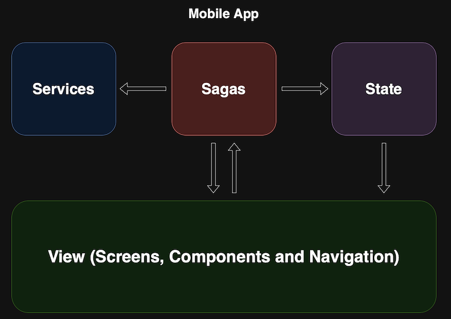

# AssessMint

Hello,

Since we never had the chance chat, this is just a quick overview about me.\
I'm Dani, an experienced software engineer, worked in multiple industries, and my last 5 years were all about FinTech.

My main point of strength is mobile development, especially in React-Native and Native iOS.\
My web experience was more towards Angular 2+, and ReactJS (Fairly new to NextJS).

Beside professional work, I did some personal projects. Here are the most successful 2 of them:
* Android Game: [Mean Spheres Attack](https://www.youtube.com/watch?v=z32Fe_52GvA) - 2015 (Abandoned)
* Native iOS App: [IntoWallet](https://intowallet.app) - 2023

In professional work, I have did integrations with most known digital KYC solutions, including:
* UAE Pass.
* ICA Toolkit.
* EFR - Emirates Facial Recognition.
* Sum & Substance, Cynopsis, and more.

Now back to this project.

## 1. Overview


This is AssessMint, a React-Native mobile app and a NextJS web app, created according to the provided assessment sepecifications.\
I chose this name "Assess-Mint" because I don't want to put the name of the company I'm applying for in a public repo, since I have been requested to submit this project as such.

For the web part of this assessment, I chose NextJS framework, even though I'm relatively new to this framework, I though it's the right one to go with.

Here's a list of feature status, based on the assessment document:

📱 **Mobile App**:
* ✅ Signup/login form, with username/email and password.
* ✅ Country specific username validation - UAE, India, Pakistan and France.
* ✅ Internationalization - English as base, Arabic and French, **based on device language**.
* ✅ On successful Login, theme will change based on user country, **with light and dark variants based on OS mode**.
* ✅ On successful login, username is stored in KeyChain (iOS) and using KeyStore encryption (Android).
* ✅ On dashboard, username is protected with device biometrics, and fall back to device passcode.
* ✅ Push Notifications on authentication activities. (Please see Note .1 below)
* ✅ Unit and functional test.\

Extra features:
* ✅ App icon and splash screen.
* ✅ All themes, the default ones as well as the country specific ones, have light and dark variants, that change with the operating system preferences.
* ✅ App privacy in task manager - blur effect on iOS and hidden content on Android (FLAG_SECURE).

<br/>

>**Note 1**:\
>The notifications you'll see in the app are technically locally triggered, and not sent from a server.\
>I have assumed that server logic is out-of-scope, let alone the certificates, provisioning profiles and API keys I need to commit in order for you to test on your own builds.

<br/>

🌍 **Web App**:
* ✅ Signup/login form, with username/email and password.
* ✅ login with credentials first registered in the app. (Please see Note .2 below)
* ✅ Country specific username validation - UAE, India, Pakistan and France.
* ✅ Internationalization - English as base, Arabic and French.
* ✅ On successful Login, theme will change based on user country, **with light and dark variants based on Browser mode**.
* ✅ On dashboard, username will be displayed.
* ✅ The app communicates with the APIs securely using server actions.
* ✅ Web push notifications on authentication activities. (Please see Note .3 below)
* ✅ Responsive design across all screens. (Mobile first).
* ℹ️ Only some functional tests. (Please see Note .4 below)

Extra features:
* ✅ Favicon.
* ✅ All themes, the default ones as well as the country specific ones, have light and dark variants, that change with the operating system preferences.

<br/>

>**Note 2**:\
>In order to login on web app with credentials used to signup on mobile, the same server instance must be running when doing this activity.\
> I couldn't find time to build a server and connect a DB to preserve user data. I assumed it's out-of-scope.

>**Note 3**:\
>The notifications you'll see in the app are technically locally triggered, and not sent from a server.\
>I have assumed that server logic is out-of-scope, let alone creating a firebase project, keys, certificates, etc.

>**Note 4**: 🔊\
>The whole web app is made in one day, and I ran completely out of time to create tests.\
>**In real projects I don't commit code without tests, but here, I had to choose, either full implementation without tests, or half implementation with test, I chose the former.**

>**Note 5**:\
>You can search for "@ReviewTeam" in this repo. I have left few notes here and there.

<br/>

## 2. Project Architecture
For this project, since a lot of aspects are shared between the 2 apps, and they operate on a similar technologies (React & JS), I decided to to with the **monorepo** approach.\

Workspaces are divided into 2 main categories, apps, and packages that are dependencies of the apps:
* Apps:
  * 📱 **Mobile**: React-Native app.
  * 🌍 **Web**: NextJS web app.
* Packages:
  * 🛠️ **Core**: Main dependency of all the workspaces. Includes the business logic / validation / rules and main types and classes of the business, including a unified JS Error.
  * 📡 **API**: Contains the API interfaces, types and all the DTOs to communicate with the backend. It's not 100% optimal in this project due to time and scope limitiations. (Please see Note .6)
  * 🎨 **Theme**: Contains the theme models, types, and definitions.

<br/>


<br/>

>**Note 6**:\
>The API package is not really what I want it to be. It's supposed to contain the implementation of calling the API server, rather than leaving it to a service in each app.
>Couldn't find the time to build a server, so I ended up with this.

>**Note 7**:\
>I wanted to create another package for ESLint rules, rather than the inheritance-based model currently implemented, but yet again, no time to do so.

<br/>

## 2. Mobile App Architecture
The design pattern that I chose for the mobile app is based on the **Sagas Pattern**, highlighted in the image below./

Basically, the view is a function of the state, just like any other app, but state mutations happen inside special functions called **Saga**, which handle calling external and internal services, applying business logic, and do app wide validations.

The state management solution is RTK (Redux Toolkit).

<br/>



<br/>

## 3. Running the App:

### Environment:
- Node v21
- Yarn v3.6.4
- XCode v15.4
- Cocoapods v1.15.2
- Android Studio Koala
- Ruby v2.6
- Ruby Gems v3.0.3.1
- Bundler v1.17.2

<br/>

>**Important Note** 🔊:\
>Please update the API base URL in "config/api.config.ts" if you're willing to use service like ngrok, in order to call NextJS APIs from a physical device.

<br/>

### Install Dependencies:

- Install node modules: this will install all dependencies and build all packages.
```bash
yarn install
```

- Install mobile app cocoapods:
```bash
cd apps/mobile/ios && bundler exec pod install 
```
<br/>

### Run mobile app:
Run react-native metro:
```bash
cd apps/mobile && yarn start # Or cd .. && yarn start if you're still in the same terminal
```

#### iOS:
- Open the "AssessmintMobile.xcworkspace" file in Xcode, and set application signing settings.
- Run on physical device or simulator.
- On another terminal, run NextJS dev server. The APIs that the app communicate with are in there.
```bash
cd apps/web && yarn dev
```

#### Android:
- Install app:
```bash
cd apps/mobile && yarn android
```
- If installed on a physical device, run:
```bash
adb reverse tcp:8081 tcp:8081
```
- On another terminal, run NextJS dev server. The APIs that the app communicate with are in there.
```bash
cd apps/web && yarn dev
```

### Run web app:
Simply run the NextJS project:
```bash
cd apps/web && yarn dev
```
----
# Thank you!